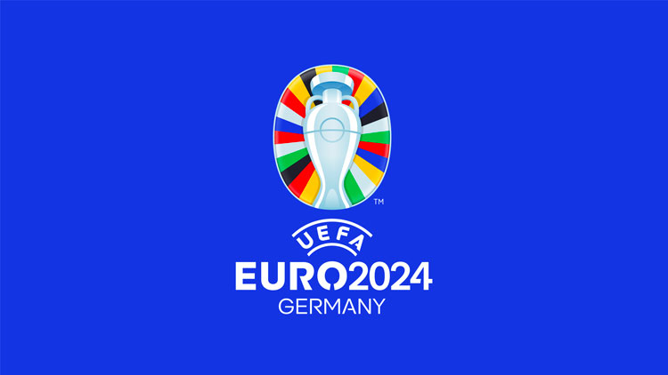
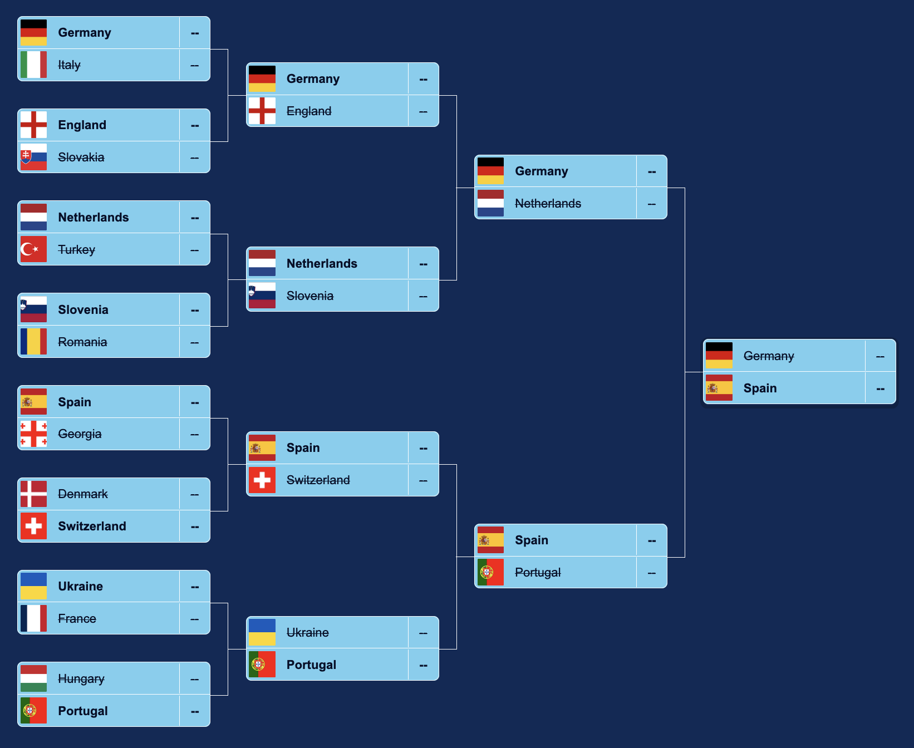
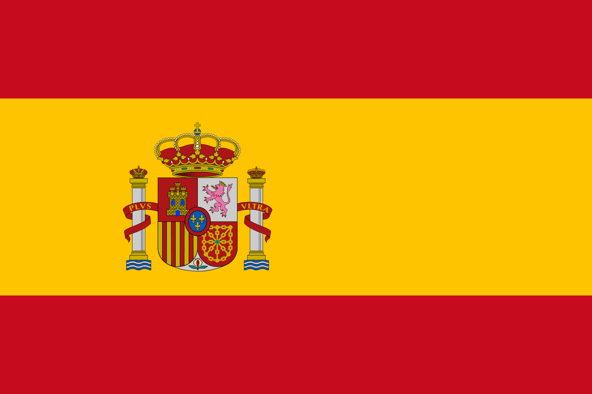

# euros-WebScraping

Football is the sport of life and the running Euros competition has been celebrating the culture since the 1960s. With the most recent rendition (as of the making of this repository) being UEFA's Euro 2024 competition, excitement draws near to crown a new European Nation within the sport. 

This repository is a mixed project and self-assigned teaching to the principles of web scraping and machine learning advantaging of past football performances of National Teams to predict the Euro 2024 winner. 

The purpose of this is to learn the fundamentals of Data Science by familiarizing myself with the relevant tools (in this project, python and relevant packages) and practically put these tools to use with relevant real-world scenarios within the sport of football.

## Methods 

Python packages used within this project 

* requests
* beautifulsoup
* pandas
* io
* scikit-learn

The first four packages were deployed to scrape web-page data from [Terrikon](https://terrikon.com/en/), a football database containing all the past Euros outcomes. With them, I then formed a database containing each team's performance against another team and at what stage in the competition. 

scikit-learn was employed for the RandomForestClassifier that acted as my machine-learning algorithm to predict the results of fixtures in the Euros competition. 

### Metrics

To train the RandomForestClassifier, we needed to set the relevant deciding factors of a game. For my model, I chose the following:  

* Team
* Opponent
* Stage of Competition
* Match Type

## Performance

The model hovered between a 55-73% accuracy rate, with projecting the least confidence in correctly predicting a draw. There is further room for error when deciding the missing spots for the Round of 16. The UEFA page saves three spaces in the Knockout Round for Third-place finisher. The metric I decided was complete random draw. A consequent re-run of the program might produce a new winner based on the outcome of the draw. 

With my first model, here is the Euros 2024 Knockout Round fully predicted!
 

And the crowned winner in . . .

  
Spain!

## Results 

To be filled in when the competition results have fully come out

## Take-aways 

From this project, I learned how to wrangle with online databases and manipulate relevant html tags to format a DataFrame with the desired data for my RandomForestClassifier model. I am more confident in my Python skills as I had to clean data that was formatted not so friendly in awkward html tables or creviced in odd html tags. As well, I have a greater understanding in the purpose of the packages I used within this project. 

This project was a fun demonstration and learning moment for what my possible work will look like as a Data Scientist post-graduation. As my first practical experience, this was a great teaching moment. A lot of the code was redundant and repeated but I am preserving the nature of the Notebooks to show the progression of my understanding. 

From this point, I trust this project will serve as a great basis to my future endeavors and be crucial to my understandings of finding relevant data and modeling them practically.

## Crediting 

This project was aided with the teaching from package documentations and the following YouTube videos: 

>[Normalized Nerd's Decision Tree Classification](https://www.youtube.com/watch?v=ZVR2Way4nwQ)   
>[Data Quest's Predict Football Match Winners](https://www.youtube.com/watch?v=0irmDBWLrco)

## License 

[MIT](https://choosealicense.com/licenses/mit/)